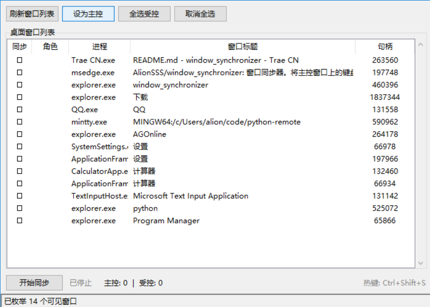

# 多游戏窗口同步器

将主控窗口上的键盘、鼠标操作实时同步到多个受控游戏窗口，实现"操作一个，全部跟随"。

## 适用场景

- 同时运行多个相同游戏窗口，需要统一操控
- 目标游戏为 Win32 GDI 渲染（基于 Windows 消息机制处理输入）




## 功能特性

- **窗口枚举** — 自动列出桌面所有可见窗口，显示进程名和标题
- **主控/受控选择** — 指定一个窗口为主控，勾选其余窗口为受控
- **键盘同步** — 主控窗口上的按键（含组合键）同步到所有受控窗口
- **鼠标同步** — 左键/右键/中键点击 + 拖拽 + 光标移动同步，支持跨窗口比例坐标映射
- **全局热键** — `Ctrl+Shift+S` 快速启停同步
- **窗口状态监控** — 窗口关闭时自动移除或停止同步

## 环境要求

- Windows 10/11 (64-bit)
- Python 3.11+
- [uv](https://docs.astral.sh/uv/) 包管理器

## 快速开始

```powershell
# 克隆项目
git clone <repo-url>
cd window_synchronizer

# 初始化环境并运行
uv sync
uv run python main.py
```

## 使用说明

1. 启动程序，点击 **刷新窗口列表** 枚举桌面窗口
2. 在列表中选择一个窗口，点击 **设为主控**
3. 勾选需要同步的窗口（单击"同步"列或双击行）
4. 点击 **开始同步** 或按 `Ctrl+Shift+S` 启动
5. 在主控窗口上进行操作，受控窗口自动跟随
6. 再次点击 **停止同步** 或按 `Ctrl+Shift+S` 停止

> 注意：只有当前激活（前景）窗口为主控窗口时，键盘和鼠标事件才会被转发。在受控窗口或其他应用上的操作不会触发同步。

## 项目结构

```
window_synchronizer/
├── main.py           # GUI 主界面 (tkinter)
├── sync_engine.py    # 同步引擎 (Win32 钩子 + 消息转发)
├── pyproject.toml    # 项目配置 (uv)
└── .trae/specs/      # 开发规范文档
```

## 技术架构

```
┌──────────────────────────────────┐
│            main.py               │
│         (tkinter GUI)            │
│  窗口列表 │ 控制面板 │ 状态栏     │
└──────────────┬───────────────────┘
               │ 通知队列 (Queue)
┌──────────────▼───────────────────┐
│         sync_engine.py           │
│                                  │
│  WH_KEYBOARD_LL ──► 按键转发    │
│  WH_MOUSE_LL    ──► 点击/移动   │
│  RegisterHotKey ──► Ctrl+Shift+S │
│                                  │
│  PostMessageW ──► 受控窗口       │
└──────────────────────────────────┘
```

- **键盘钩子** (`WH_KEYBOARD_LL`)：捕获主控窗口按键 → `PostMessageW` 转发 `WM_KEYDOWN/UP`
- **鼠标钩子** (`WH_MOUSE_LL`)：捕获点击/移动 → `ScreenToClient` 坐标转换 → `PostMessageW` 转发
- **热键**：`RegisterHotKey` + 窗口过程子类化 → `Ctrl+Shift+S` 启停
- **线程模型**：钩子运行在独立后台线程；通知通过 `Queue` 传递至主线程 UI

## 打包为 EXE

```powershell
pip install pyinstaller
pyinstaller -D -w -i resources\icon.ico -n window_synchronizer main.py
```

参数说明：
- `-D`：生成目录形式（启动更快）
- `-w`：无控制台窗口
- `-i`：指定图标
- `-n`：输出名称