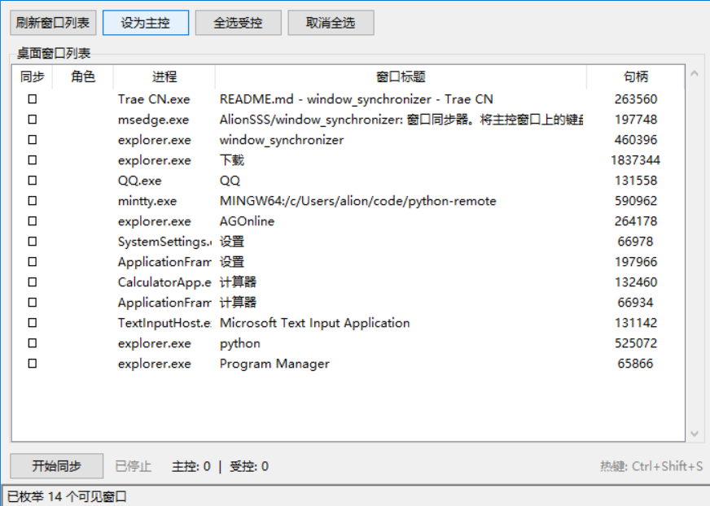

# 多游戏窗口同步器

将主控窗口上的键盘、鼠标操作实时同步到多个受控游戏窗口，实现"操作一个，全部跟随"。

<br />

*想要直接使用？从* *[Releases](https://github.com/AlionSSS/window_synchronizer/releases)* *下载最新版本，例如* *`window_synchronizer_v0.3.0.zip`。*

## 适用场景

- 同时运行多个相同游戏窗口，需要统一操控
- 目标游戏为 Win32 GDI 渲染（基于 Windows 消息机制处理输入）

## 功能特性

- **窗口枚举** — 自动列出桌面所有可见窗口，显示进程名和标题
- **主控/受控选择** — 指定一个窗口为主控，勾选其余窗口为受控
- **同步范围可选** — 支持「全部同步 / 仅键盘 / 仅鼠标」，运行中可实时切换（默认「全部同步」）
- **键盘同步** — 主控窗口上的按键（含组合键）同步到所有受控窗口
- **鼠标同步** — 左键/右键/中键点击 + 拖拽 + 光标移动同步，支持跨窗口比例坐标映射
- **全局热键** — `Ctrl+Shift+S` 快速启停同步
- **窗口状态监控** — 窗口关闭时自动移除或停止同步



## 使用说明

1. 启动程序 `window_synchronizer.exe`，点击 **刷新窗口列表** 枚举桌面窗口
2. 在列表中选择一个窗口，点击 **设为主控**
3. 勾选需要同步的窗口（单击「同步」列，或双击该行的其它列）
4. 在 **同步范围** 中选择需要同步的输入类型（默认「全部同步」，见下文）
5. 点击 **开始同步** 或按 `Ctrl+Shift+S` 启动
6. 在主控窗口上进行操作，受控窗口自动跟随
7. 再次点击 **停止同步** 或按 `Ctrl+Shift+S` 停止

## 同步范围

在控制栏上方的单选按钮中可自由选择要同步的输入类型，**默认「全部同步」**，且**运行中切换立即生效，无需重启同步**：

| 选项 | 键盘同步 | 鼠标同步 | 适用场景 |
| --- | :---: | :---: | --- |
| **全部同步**（默认） | ✅ | ✅ | 需要同时转发键盘与鼠标操作 |
| **仅键盘** | ✅ | ❌ | 只需要同步按键（如挂机脚本按键） |
| **仅鼠标** | ❌ | ✅ | 只需要同步点击 / 移动 |

> 未被选中的输入类型只会「不转发」，主控窗口自身的键盘 / 鼠标输入不受影响。

## 注意事项

1. 只有当前激活（前台）窗口为主控窗口时，键盘和鼠标事件才会被转发；在受控窗口或其他应用上的操作不会触发同步。
2. Windows「设置 → 系统 → 屏幕 → 缩放与布局」需要设置为 **100%**，否则坐标映射会出现偏移。
3. 建议本程序与目标游戏以**相同权限**运行：若游戏以管理员身份运行，本程序也需以管理员身份运行，否则转发的消息可能被系统拒绝。
4. 部分带有反作弊机制的游戏可能拦截模拟输入，本工具仅适用于允许此类操作的游戏。

## 开发环境要求

- Windows 10/11 (64-bit)
- Python 3.11+
- [uv](https://docs.astral.sh/uv/) 包管理器

## 使用源码开始

```powershell
# 克隆项目
git clone https://github.com/AlionSSS/window_synchronizer.git
cd window_synchronizer

# 安装依赖并运行
uv sync
uv run python main.py
```

### 代码检查与格式化

项目使用 [ruff](https://docs.astral.sh/ruff/) 进行代码检查与格式化：

```powershell
# 通过 uvx 直接运行（无需安装到项目环境）
uvx ruff check .
uvx ruff format .
```

## 项目结构

```
window_synchronizer/
├── main.py               # GUI 主界面 (tkinter)
├── sync_engine.py        # 同步引擎 (Win32 钩子 + 消息转发)
├── theme.py              # 主题配置 (莫兰迪蓝色调)
├── resources/
│   └── icon.ico          # 程序图标
├── pyproject.toml        # 项目配置 (uv)
├── uv.lock               # 依赖锁定文件
├── LICENSE               # MIT 许可证
└── README.md
```

## 技术架构

```
┌──────────────────────────────────────────┐
│                main.py                   │
│             (tkinter GUI)                │
│   窗口列表 │ 同步范围 │ 控制面板 │ 状态栏  │
└────────────────────┬─────────────────────┘
                     │ 通知队列 (Queue)
┌────────────────────▼─────────────────────┐
│              sync_engine.py              │
│                                          │
│  WH_KEYBOARD_LL ─┐                       │
│                  ├─► 同步范围闸门         │
│  WH_MOUSE_LL ────┘   (BOTH/KEYBOARD/     │
│                       MOUSE)             │
│  RegisterHotKey ──► Ctrl+Shift+S         │
│                                          │
│  PostMessageW ──► 受控窗口                │
└──────────────────────────────────────────┘
```

- **键盘钩子** (`WH_KEYBOARD_LL`)：捕获主控窗口按键 → `PostMessageW` 转发 `WM_KEYDOWN/UP`
- **鼠标钩子** (`WH_MOUSE_LL`)：捕获点击/移动 → `ScreenToClient` 坐标转换 → `PostMessageW` 转发
- **同步范围** (`SyncMode`)：在钩子回调入口按所选范围放行，未选中的输入类型不参与转发
- **热键**：`RegisterHotKey` + 窗口过程子类化 → `Ctrl+Shift+S` 启停
- **线程模型**：钩子运行在独立后台线程；通知通过 `Queue` 传递至主线程 UI

## 打包为 EXE

```powershell
# 安装 PyInstaller（作为开发依赖）
uv add --dev pyinstaller

# 打包
uv run pyinstaller -D -w -i resources\icon.ico --add-data "resources\icon.ico:resources" -n window_synchronizer main.py
```

参数说明：

- `-D`：生成目录形式（启动更快）
- `-w`：无控制台窗口
- `-i`：指定图标
- `--add-data`：打包资源文件，格式为 `源路径:目标目录`
- `-n`：输出名称

> 提示：`--add-data` 使用冒号 `:` 作为分隔符（与官方文档一致）。个别 PyInstaller 版本在 Windows 上可能需要改用分号 `;`，若资源未被正确打包请尝试调整。

## 常见问题

**Q：开始同步后受控窗口没有任何反应？**

- 确认已设置主控窗口，且至少勾选了一个受控窗口；
- 确认操作时主控窗口处于前台激活状态；
- 确认「同步范围」包含你正在使用的输入类型；
- 确认屏幕缩放为 100%，且程序与游戏的权限一致。

**Q：`Ctrl+Shift+S` 热键无效？**

该组合键可能已被其它软件占用，程序会在状态栏提示注册失败，此时请改用界面按钮启停。

**Q：主控窗口关闭后会怎样？**

程序会自动检测并停止同步，同时在列表中移除已关闭的窗口。

## 免责声明

本工具仅用于合法的多窗口操作同步与技术学习研究。请勿将其用于违反任何游戏服务条款或相关法律法规的场景，使用者需自行承担因使用本工具产生的一切后果。

## 许可证

本项目基于 [MIT License](LICENSE) 开源。
